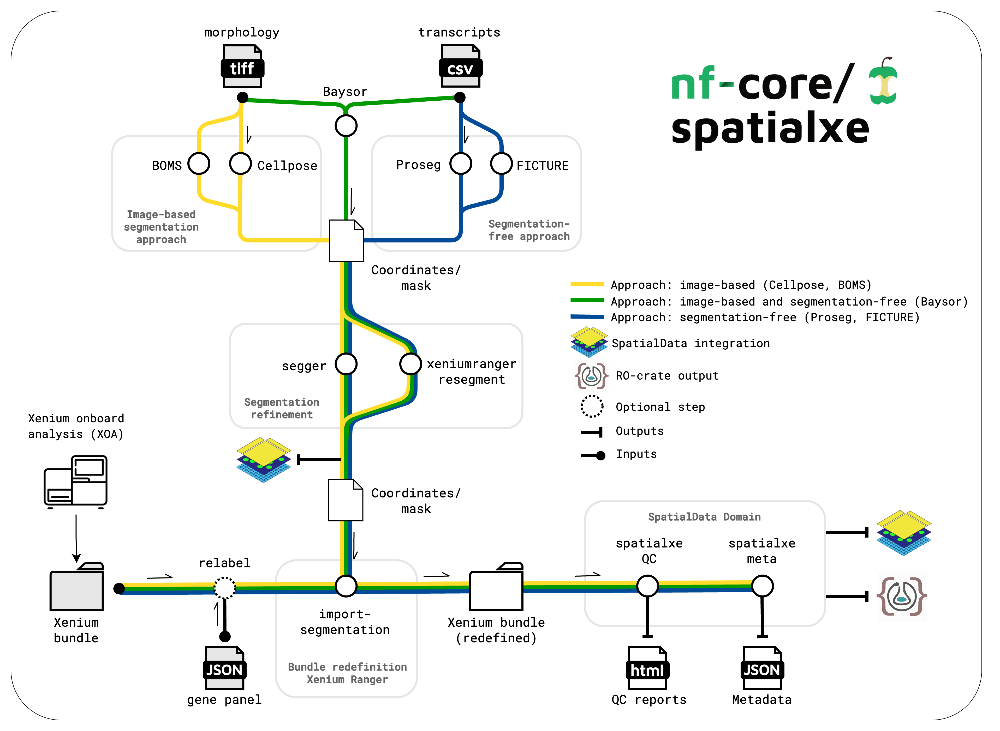

<h1>
  <picture>
    <source media="(prefers-color-scheme: dark)" srcset="docs/images/nf-core-spatialxe_logo_dark.png">
    
  </picture>
</h1>

[](https://github.com/nf-core/spatialxe/actions/workflows/ci.yml)
[](https://github.com/nf-core/spatialxe/actions/workflows/linting.yml)[](https://nf-co.re/spatialxe/results)[](https://doi.org/10.5281/zenodo.XXXXXXX)
[](https://www.nf-test.com)

[](https://www.nextflow.io/)
[](https://docs.conda.io/en/latest/)
[](https://www.docker.com/)
[](https://sylabs.io/docs/)
[](https://cloud.seqera.io/launch?pipeline=https://github.com/nf-core/spatialxe)

[](https://nfcore.slack.com/channels/spatialxe)[](https://twitter.com/nf_core)[](https://mstdn.science/@nf_core)[](https://www.youtube.com/c/nf-core)

## Introduction

**nf-core/spatialxe** is a bioinformatics best-practice processing and quality control pipeline for Xenium data. **The pipeline is currently under developement and not completed yet!**. The current plan for the pipeline implementation is shown in the metromap below. Please note that the pipeline steps and methods might change as we move forward in the development cycle.



<!-- TODO nf-core: Include a figure that guides the user through the major workflow steps. Many nf-core
     workflows use the "tube map" design for that. See https://nf-co.re/docs/contributing/design_guidelines#examples for examples.   -->

1. Present QC for raw reads ([`MultiQC`](http://multiqc.info/))

## Usage

On release, automated continuous integration tests run the pipeline on a full-sized dataset on the AWS cloud infrastructure. This ensures that the pipeline runs on AWS, has sensible resource allocation defaults set to run on real-world datasets, and permits the persistent storage of results to benchmark between pipeline releases and other analysis sources. The results obtained from the full-sized test can be viewed on the [nf-core website](https://nf-co.re/spatialxe/results).

## Pipeline summary

## Quick Start

`samplesheet.csv`:

```csv
sample,bundle,image
test_sample,/path/to/xenium-bundle,/path/to/morphology.ome.tif
```

Now, you can run the pipeline using:

<!-- TODO nf-core: update the following command to include all required parameters for a minimal example -->

## Run image-based segmentation mode <br>

`CELLPOSE -> BAYSOR -> XR-IMPORT_SEGMENTATION -> SPATIALDATA -> QC`

```bash
nextflow run nf-core/spatialxe \
   -profile <docker/singularity/.../institute> \
   --input samplesheet.csv \
   --outdir <OUTDIR> \
   --mode image
```

## Run coordinate-based segmentation mode <br>

`PROSEG -> PROSEG2BAYSOR -> XR-IMPORT_SEGMENTATION -> SPATIALDATA -> QC`

```bash
nextflow run nf-core/spatialxe \
   -profile <docker/singularity/.../institute> \
   --input samplesheet.csv \
   --outdir <OUTDIR> \
   --mode coordinate
```

> [!WARNING]
> Please provide pipeline parameters via the CLI or Nextflow `-params-file` option. Custom config files including those provided by the `-c` Nextflow option can be used to provide any configuration _**except for parameters**_; see [docs](https://nf-co.re/docs/usage/getting_started/configuration#custom-configuration-files).

For more details and further functionality, please refer to the [usage documentation](https://nf-co.re/spatialxe/usage) and the [parameter documentation](https://nf-co.re/spatialxe/parameters).

## Pipeline output

To see the results of an example test run with a full size dataset refer to the [results](https://nf-co.re/spatialxe/results) tab on the nf-core website pipeline page.
For more details about the output files and reports, please refer to the
[output documentation](https://nf-co.re/spatialxe/output).

## Credits

nf-core/spatialxe was originally written by [Sameesh Kher](https://github.com/khersameesh24) and [Florian Heyl](https://github.com/heylf).

We thank the following people for their extensive assistance in the development of this pipeline:

- Tobias Krause
- Krešimir Beštak (kbestak)
- Matthias Hörtenhuber (mashehu)

## Contributions and Support

If you would like to contribute to this pipeline, please see the [contributing guidelines](.github/CONTRIBUTING.md).

For further information or help, don't hesitate to get in touch on the [Slack `#spatialxe` channel](https://nfcore.slack.com/channels/spatialxe) (you can join with [this invite](https://nf-co.re/join/slack)).

## Citations

<!-- TODO nf-core: Add citation for pipeline after first release. Uncomment lines below and update Zenodo doi and badge at the top of this file. -->
<!-- If you use nf-core/spatialxe for your analysis, please cite it using the following doi: [10.5281/zenodo.XXXXXX](https://doi.org/10.5281/zenodo.XXXXXX) -->

<!-- TODO nf-core: Add bibliography of tools and data used in your pipeline -->

An extensive list of references for the tools used by the pipeline can be found in the [`CITATIONS.md`](CITATIONS.md) file.

You can cite the `nf-core` publication as follows:

> **The nf-core framework for community-curated bioinformatics pipelines.**
>
> Philip Ewels, Alexander Peltzer, Sven Fillinger, Harshil Patel, Johannes Alneberg, Andreas Wilm, Maxime Ulysse Garcia, Paolo Di Tommaso & Sven Nahnsen.
>
> _Nat Biotechnol._ 2020 Feb 13. doi: [10.1038/s41587-020-0439-x](https://dx.doi.org/10.1038/s41587-020-0439-x).
